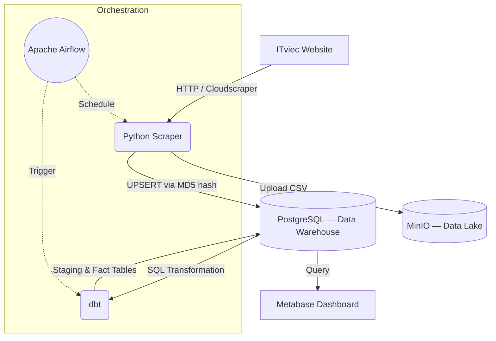
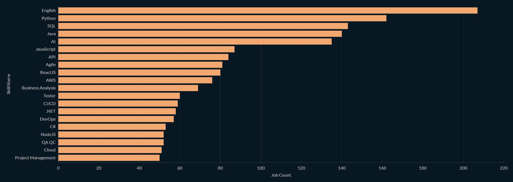
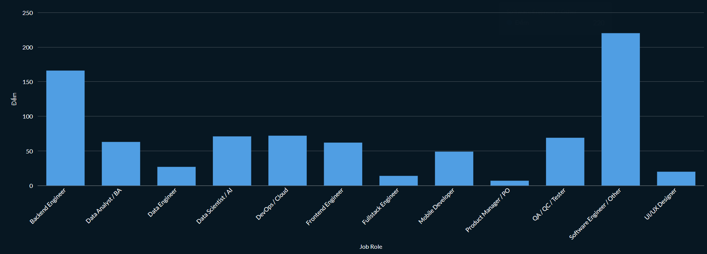
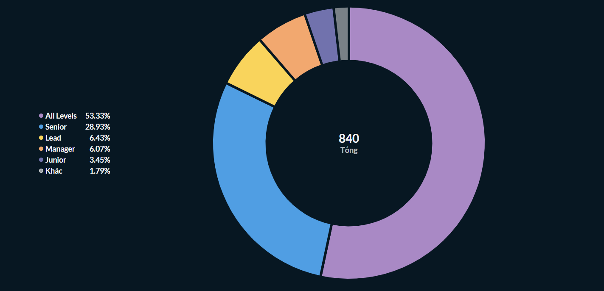

# Vietnam IT Job Market — Data Pipeline


Pipeline dữ liệu end-to-end thu thập tin tuyển dụng IT từ [ITviec](https://itviec.com), lưu trữ dữ liệu thô trên MinIO (Data Lake tương thích S3), nạp vào PostgreSQL theo cơ chế incremental, sau đó transform bằng dbt và trực quan hoá trên Metabase.

Toàn bộ hệ thống chạy trong Docker, không cần cài đặt thêm gì ngoài Docker Desktop và Python.

---

## Kiến trúc hệ thống



**Luồng dữ liệu:** Web → MinIO (Data Lake) → PostgreSQL (DWH) → dbt (Transform) → Metabase (BI)

---

## Tính năng chính

**Incremental Loading (Upsert)**
Mỗi tin tuyển dụng được băm MD5 từ tên vị trí và công ty. Pipeline có thể chạy lặp lại hàng ngày mà không sinh ra dữ liệu trùng.

**Data Lake**
File CSV thô được upload lên MinIO trước khi ghi vào database, giúp tái nạp lại dữ liệu bất kỳ lúc nào mà không cần cào lại từ web.

**Transformation với dbt (4 model)**
- `stg_jobs` — Parsing cột lương từ chuỗi văn bản sang dạng số.
- `int_jobs_categorized` — Phân loại tự động 12 nhóm nghề và 7 cấp bậc từ tên công việc.
- `fct_skills` — Thống kê tần suất kỹ năng trên toàn bộ tin tuyển dụng.
- `fct_salary_by_role_level` — Mức lương trung bình và cao nhất theo vị trí và cấp bậc.

**Data Quality Tests**
Sau mỗi lần transform, dbt tự động kiểm tra `not_null` và `unique` trên các cột quan trọng trước khi dữ liệu vào Dashboard.

---

## Cấu trúc thư mục

```
vietnam-it-job-pipeline/
├── airflow/
│   └── dags/
│       └── job_pipeline_dag.py       # DAG: scrape → dbt run → dbt test
├── dbt_transform/
│   ├── models/
│   │   ├── stg_jobs.sql
│   │   ├── int_jobs_categorized.sql
│   │   ├── fct_skills.sql
│   │   ├── fct_salary_by_role_level.sql
│   │   └── schema.yml                # Định nghĩa data quality tests
│   └── dbt_project.yml
├── src/
│   ├── scraper.py                    # Script chính: cào web → MinIO → PostgreSQL
│   ├── load_from_minio.py            # Tải lại data từ MinIO vào DB
│   └── load_from_csv.py             # Tải từ file CSV local (dùng khi MinIO không có data)
├── docker-compose.yml                # PostgreSQL, Airflow, MinIO, Metabase
├── init.sql                          # Khởi tạo schema database
└── requirements.txt
```

---

## Yêu cầu

- Docker Desktop
- Python 3.9+

---

## Hướng dẫn chạy

**1. Khởi động toàn bộ services**
```bash
docker-compose up -d
```

**2. Tạo môi trường Python**
```bash
python -m venv .venv
.venv\Scripts\activate
pip install -r requirements.txt
```

**3. Chạy scraper**
```bash
# CMD
set PYTHONIOENCODING=utf-8 && .venv\Scripts\python src/scraper.py

# PowerShell
$env:PYTHONIOENCODING="utf-8"; .venv\Scripts\python src/scraper.py
```

> Nếu ITviec trả về lỗi 403, dùng script tiện ích để nạp lại data từ MinIO:
> ```bash
> .venv\Scripts\python src/load_from_minio.py
> ```

**4. Chạy dbt**
```bash
cd dbt_transform
..\.venv\Scripts\dbt run --profiles-dir .
..\.venv\Scripts\dbt test --profiles-dir .
```

**5. Truy cập các services**

| Service  | URL                    | Tài khoản               |
|----------|------------------------|-------------------------|
| Metabase | http://localhost:3000  | Tạo tài khoản lần đầu  |
| Airflow  | http://localhost:8080  | admin / admin           |
| MinIO    | http://localhost:9001  | admin / password        |

Kết nối Metabase với PostgreSQL: `host=postgres`, `db=job_market`, `user=de_user`, `pass=de_password`.

Các bảng để phân tích:

| Bảng | Nội dung |
|------|----------|
| `fct_skills` | Xếp hạng kỹ năng theo số lượng tin tuyển dụng |
| `fct_salary_by_role_level` | Mức lương theo vị trí và cấp bậc |
| `int_jobs_categorized` | Danh sách job đã được phân loại nghề và level |

---

## Lưu ý

- Dữ liệu lương (`fct_salary_by_role_level`) thường thưa vì phần lớn tin tuyển dụng trên ITviec ghi "Thoả thuận" thay vì mức lương cụ thể.
- Thư mục `data/raw/` và toàn bộ file `.csv` không được đưa lên version control.
- Nếu scraper trả về lỗi 403 (Cloudflare chặn), dùng script tiện ích để nạp lại data từ MinIO hoặc CSV:
  ```bash
  .venv\Scripts\python src/load_from_minio.py
  ```

---

## Dashboard

Một số biểu đồ được xây dựng trên Metabase từ dữ liệu thu thập thực tế:

**Top 20 kỹ năng IT được tuyển dụng nhiều nhất**


**Phân bổ việc làm theo nhóm ngành**


**Phân bổ cấp bậc (Level)**


---

*Dự án portfolio cá nhân — xây dựng với mục tiêu thực hành kiến trúc ELT và Modern Data Stack.*
