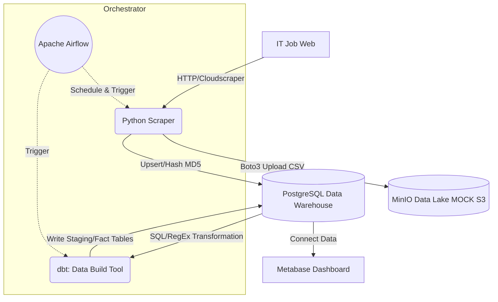

# 📊 Hệ thống Data Pipeline: Phân tích Thị trường Việc làm IT Việt Nam

-blue)


Dự án Data Engineering End-to-End ứng dụng kiến trúc **ELT (Extract, Load, Transform)** để thu thập, làm sạch và trực quan hoá xu hướng kỹ năng/mức lương ngành IT dựa trên dữ liệu tuyển dụng thực tế. Hệ thống được đóng gói hoàn toàn trong Docker bằng `docker-compose`.

## 🏗️ Kiến trúc Hệ thống (Architecture Pipeline)

Dự án mô phỏng toàn trị chuỗi xử lý dữ liệu tiêu chuẩn tại các tập đoàn Tech:



### ✨ Tính năng / Công nghệ cốt lõi
- **Trích xuất dữ liệu (Python/Cloudscraper):** Bypass dạn rào chắn mã hoá của Cloudflare. Thu thập HTML qua `BeautifulSoup`.
- **Data Lake (MinIO):** Bơm dữ liệu cào được thành CSV thô và sao lưu trên MinIO (S3-compatible) cho mục đích Audit.
- **Incremental Loading (Upsert):** Dùng thuật toán Hash MD5 sinh `job_hash` chống trùng lặp dữ liệu tuyệt đối khi Airflow chạy luồng hằng ngày (Bảo vệ Database).
- **Transformation (dbt):** Áp dụng regex bằng code SQL để làm sạch chuỗi lương từ text ("1000 - 2000 USD") sang Numeric Array/Int; Pivot tách danh sách các Skill (Python, AWS, React) thành Dimension phân tích riêng.
- **BI Visualization (Metabase):** Trực quan hoá Top Ranking siêu việt.

---

## 📂 Cấu trúc Thư mục

```text
📦 it-job-market-de
 ┣ 📂 airflow               # Thư mục chứa dags và config điều phối của Airflow
 ┃ ┗ 📂 dags
 ┃   ┗ 📜 job_pipeline_dag.py
 ┣ 📂 dbt_transform         # Thư mục mã nguồn dbt (Transformation)
 ┃ ┣ 📂 models
 ┃ ┃ ┣ 📜 stg_jobs.sql      # dbt schema: Bóc tách text lương (Parsing Salary)
 ┃ ┃ ┗ 📜 fct_skills.sql    # dbt table: Đếm xếp hạng Kỹ năng
 ┃ ┗ 📜 dbt_project.yml
 ┣ 📂 src                   # Mã nguồn Python Application
 ┃ ┗ 📜 scraper.py          # Lõi cào dữ liệu, Hash, MinIO Lake và Upsert PostgreSQL
 ┣ 📂 data                  # Lưu trữ CSV local nếu không xài docker.
 ┣ 📜 docker-compose.yml    # Build toàn bộ hệ thống (db, metabase, airflow, minio)
 ┣ 📜 init.sql              # Khởi tạo Table PostgreSQL ban đầu
 ┗ 📜 requirements.txt      # Gói phụ thuộc Python
```

---

## 🚀 Hướng dẫn Chạy hệ thống local

### 1. Khởi động Cụm hệ thống (Spin-up Infrastructure)
Vì hệ thống đã được Container hoá, bạn chỉ cần gõ duy nhất một lệnh:
```bash
docker-compose up -d --build
```

### 2. Cấu hình môi trường nội bộ
Mở Command prompt (hoặc PowerShell) tại folder gốc của dự án:
```powershell
python -m venv .venv
.\.venv\Scripts\activate
pip install -r requirements.txt
```

*(Lưu ý: Nếu bị văng lỗi Emoji Unicode trên CMD, hãy chạy thêm: `$env:PYTHONIOENCODING="utf-8"`)*

### 3. Vận hành quy trình tự động trực quan (Flow)
1. **Kiểm tra MinIO (Data Lake):** Mở `http://localhost:9001` (admin/password). Bucket `it-jobs-lake` đã được tạo sẵn.
2. **Khởi động Airflow:** Truy cập `http://localhost:8080`, Bật công tắc Unpause (Enable) cho `job_market_pipeline_v1` DAG. Quá trình cào (Ext) và đẩy dbt (Tnf) sẽ chạy song song.
3. **Mở Metabase Dashboard:** Truy cập vào `http://localhost:3000`
   - Cấu hình kết nối DB bằng Host: `postgres`, Port `5432` DB Name: `job_market`, User/Pass: `de_user` / `de_password`.
   - Kết nối vào View `fct_skills` hoặc `stg_jobs` và tận hưởng biểu đồ tự tuỳ chỉnh!

---
